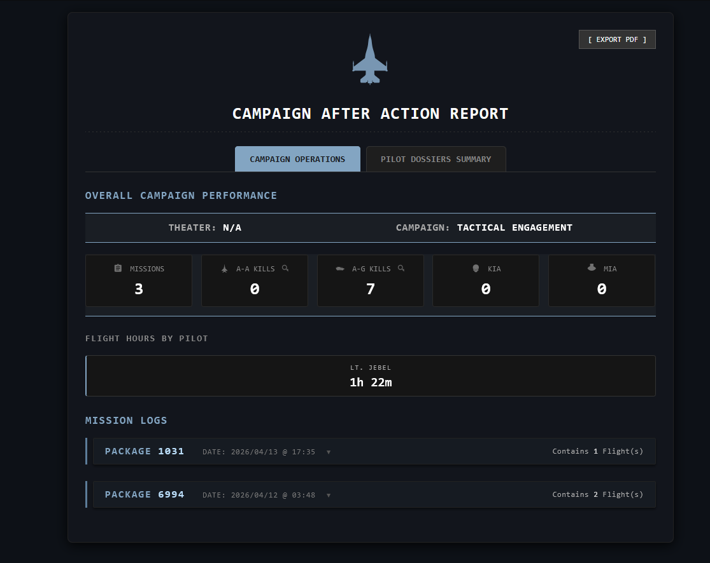
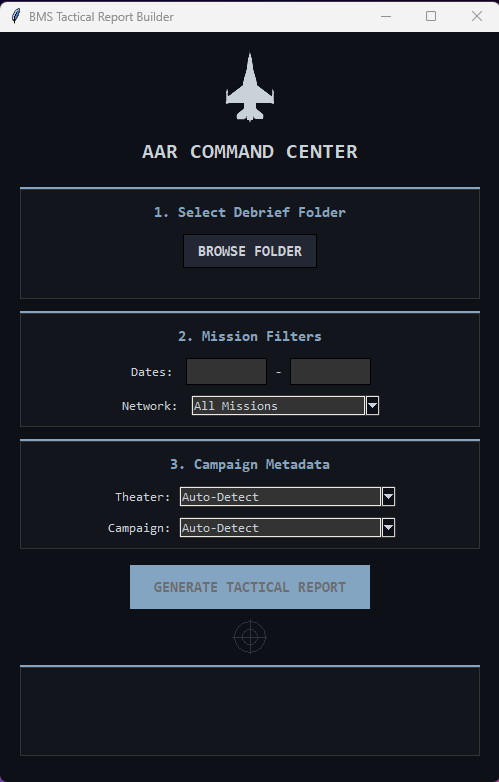

# falcon-bms-tactical-report (BETA)

Automated tactical AAR generator for Falcon BMS
# Falcon BMS Tactical Report Builder

A Python-based tool that automatically parses Falcon BMS debrief logs (`.txt`) and generates a highly detailed, interactive, and beautiful HTML Tactical After-Action Report (AAR).

## Features
* **Automated Package Grouping:** Intelligently groups flights operating in the same package using "Briefing Footprints," preventing mixed-up flights even if the campaign reuses package numbers.(still on test, you people can tell me better)
* **Interactive UI:** Built-in radar scanner UI with date, connection, and campaign filters.
* **Pilot Dossiers:** Automatically tracks individual pilot flight hours, A-A kills, A-G kills, KIA, and MIA statuses across the entire campaign.
* **Responsive HTML Export:** Generates a single-file HTML report with interactive drop-downs, tactical badges, and a dark-mode military aesthetic.
* **Training Filter:** Automatically detects and skips non-combat training flights to keep your combat statistics clean.

## How to Use (For Users)
1. Download the latest `.exe` from the **[Releases](link_to_your_releases_page)** tab.
2. Run the executable.
3. Point it to your Falcon BMS `Briefings` folder. (Falcon BMS 4.**\User\Briefings)
4. Set your filters (Dates, Multiplayer vs Singleplayer).
5. Click **Generate** and open the `Final_Campaign_Report.html`!

## How to Build from Source (For Developers)
If you want to run or compile the code yourself, it relies entirely on Python's standard libraries. No external dependencies are required to run the script.
<div align="center">
  
</div>


To build the executable yourself, you will need `pyinstaller`:
```bash
pip install pyinstaller
